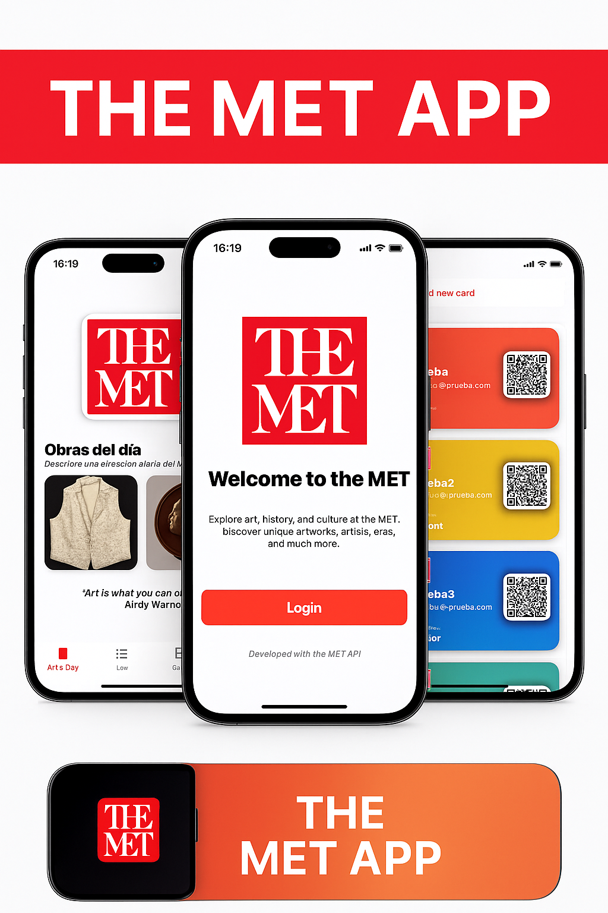
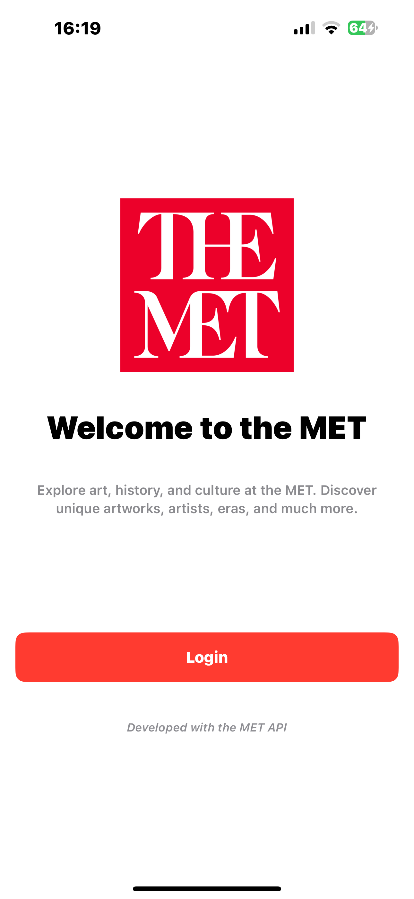
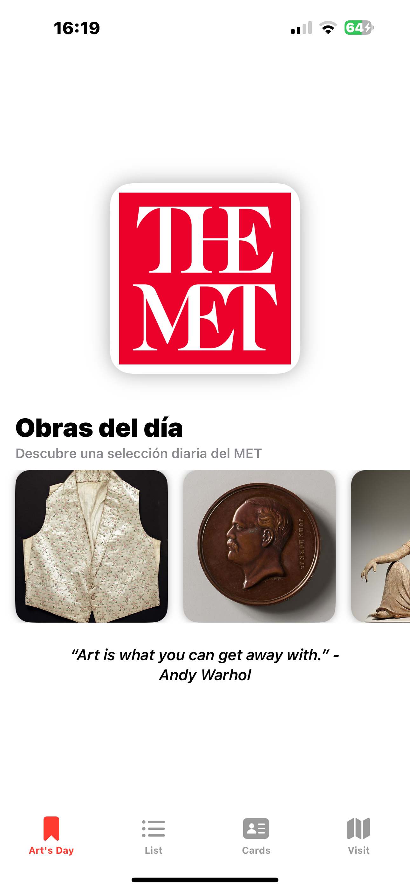
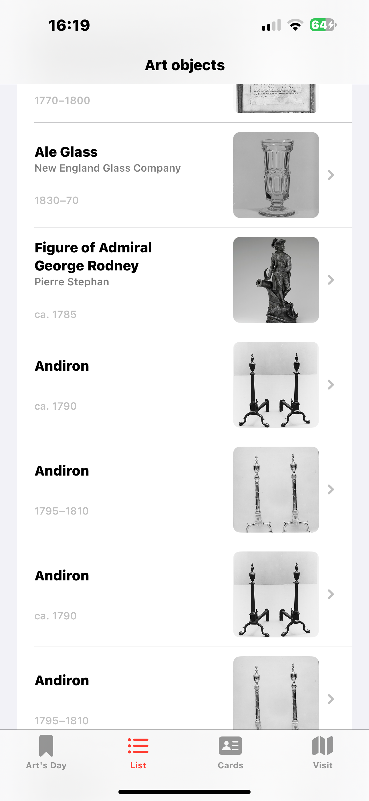
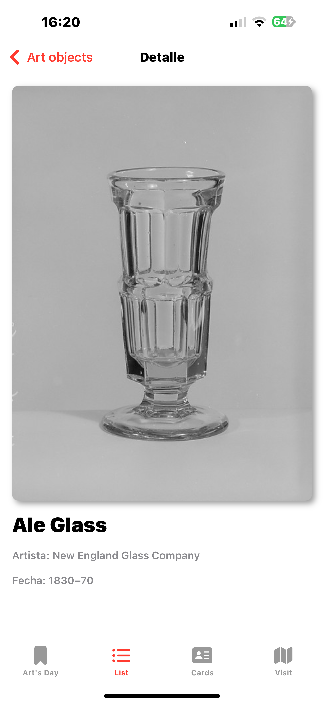
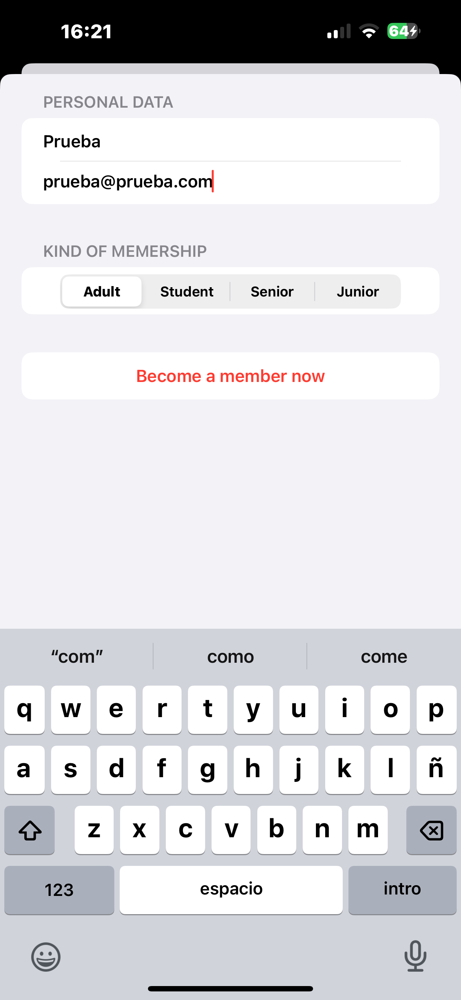
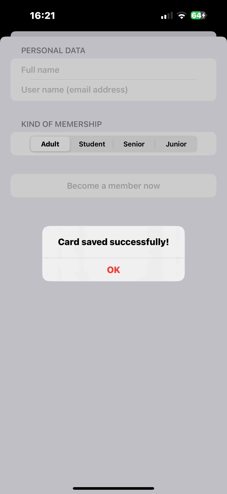
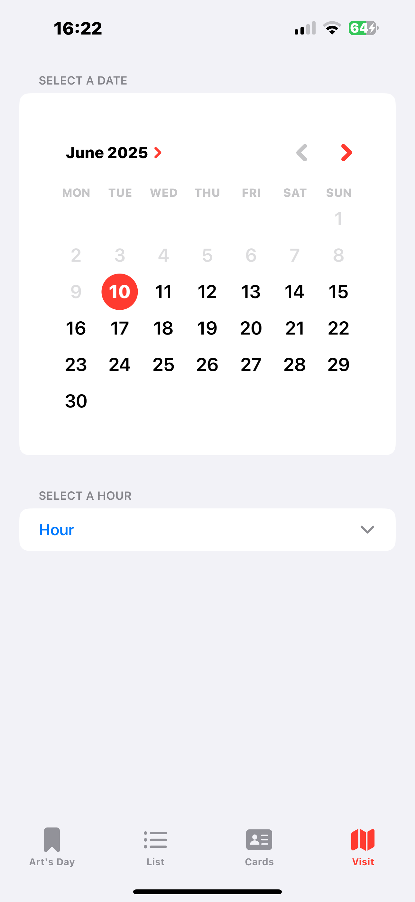
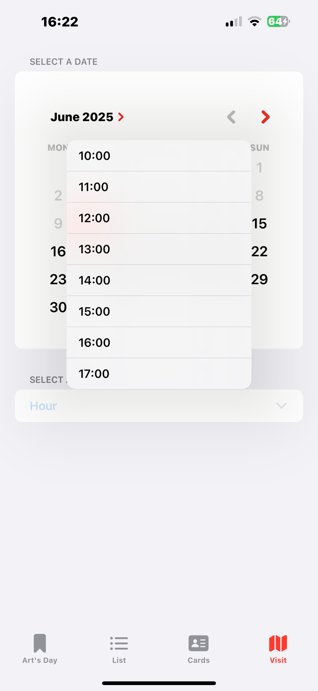
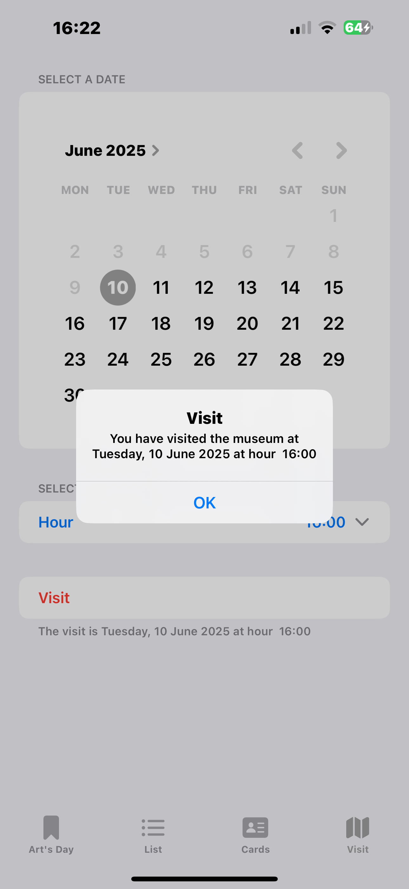

# 🖼️ MuseumApp

**MuseumApp** es una aplicación iOS desarrollada en SwiftUI que permite buscar y visualizar obras de arte utilizando la API pública del [Metropolitan Museum of Art](https://metmuseum.github.io/).

<p align="center">
  
</p>

---

## 🚀 Características

- Búsqueda de obras por nombre o palabra clave.
- Visualización de resultados con título, artista y miniatura.
- Indicadores de carga y mensajes claros cuando no se encuentran resultados.
- Detalle completo de cada obra seleccionada.
- Generación de tarjetas de membresía con código QR.
- Arquitectura organizada con ViewModel, Networking y vistas modulares.
- Almacenamiento local con SwiftData.
- Búsquedas optimizadas con caché en memoria.
- Diseño adaptado para iPhone.

---

## 🧰 Tecnologías

- Swift 6
- SwiftUI
- URLSession
- API REST del Met Museum
- Arquitectura tipo MVVM
- Swift Data
- Almacenamiento en cache

---

## 🔧 Cómo ejecutar el proyecto

1. Clona el repositorio:

   ```
   git clone https://github.com/tuUsuario/MuseumApp.git
   cd MuseumAppv
   ```
   
2. Abre el proyecto en Xcode:

   open MuseumApp.xcodeproj
   
3. Selecciona un simulador o dispositivo real y presiona Run ▶️

---

## 📡 API utilizada

Met Museum Collection API:
https://metmuseum.github.io/

Ejemplo de endpoint de búsqueda:
https://collectionapi.metmuseum.org/public/collection/v1/search?q=Pollock

---

## 📷 Capturas

<p align="center">
  
  
  
  
</p>
<p align="center">
  
  
  
  
</p>
<p align="center">
  
  
  
  
</p>

---

## ✍️ Autor

Antonio Hernández Barbadilla
GitHub

---

## 🛡️ Licencia

Este proyecto está bajo la licencia MIT.
